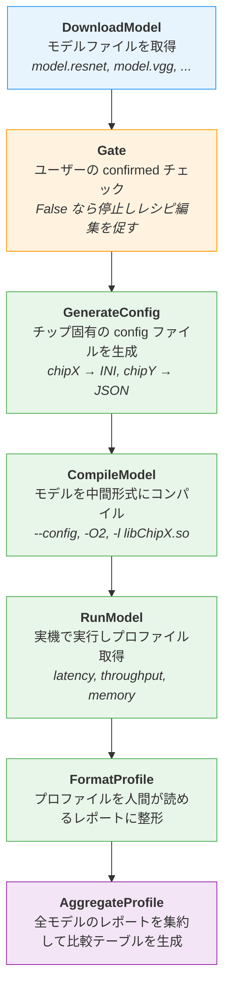
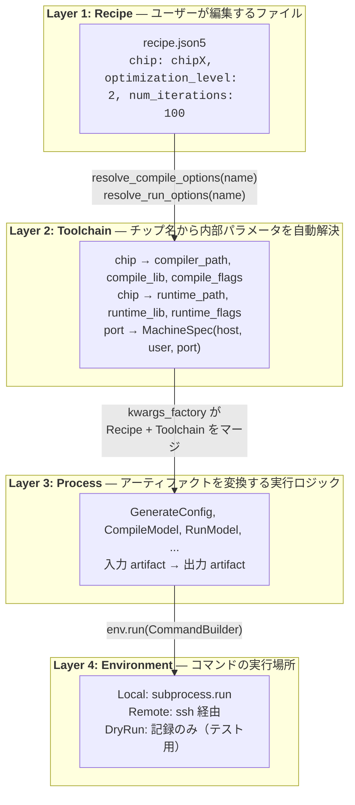
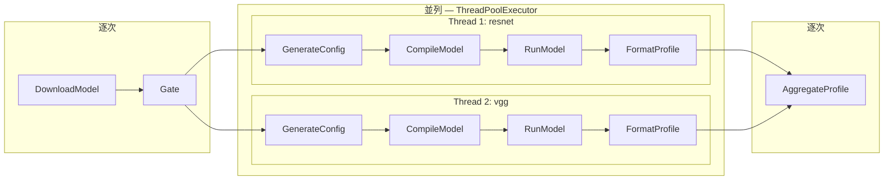
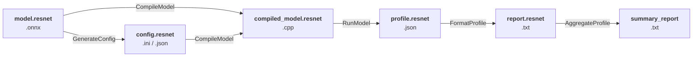
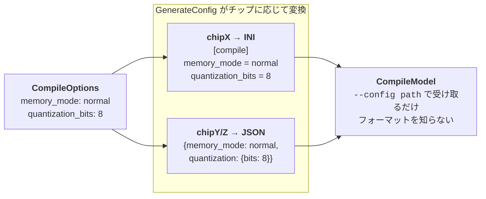
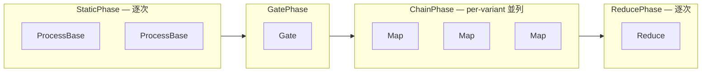

# Pipeline Artifact Model アーキテクチャ

## このシステムが解決する問題

機械学習モデルをターゲットチップ向けにコンパイルし、実機で実行してパフォーマンスを計測する
一連の作業は、手動で行うと以下の課題がある:

- **反復コスト**: モデルごとに同じ手順（ダウンロード → config 生成 → コンパイル → 実行 → レポート）を繰り返す
- **チップ依存**: チップごとにコンパイラの config フォーマットやライブラリ、フラグが異なる
- **やり直しコスト**: パラメータを一つ変えただけで全モデルを再コンパイルし直すのは無駄

本システムはこれらを、**アーティファクトベースのキャッシュ**と**自動並列化**で解決する。

---

## 典型的なワークフロー

ユーザーが行う操作は 3 ステップだけ:

```bash
# 1. テンプレートレシピを指定して初回実行
#    → モデルをダウンロードし、レシピにモデル名を書き戻して停止
python -m main my_experiment --recipe recipes/recipe.json5

# 2. レシピを編集（モデルごとの設定を確認し、confirmed: true に変更）
vim experiments/my_experiment/recipe.json5

# 3. 再実行 → ダウンロード済みモデルはキャッシュ、コンパイル以降が実行される
python -m main my_experiment
```

内部では以下のパイプラインが動作する:



DownloadModel と Gate は逐次実行。GenerateConfig 〜 FormatProfile は `Map` として宣言されており、
モデルごとに並列実行される（詳細は後述）。AggregateProfile は `Reduce` として全モデルの結果を集約する。

---

## レイヤー構成: 「誰が何を知っているか」

本システムの設計の核は、**関心の分離を 4 層で実現する**ことにある。
ユーザーはチップ名と最適化レベルだけ指定すればよく、コンパイラのパスやライブラリ名は知る必要がない。



### なぜこの分離が必要か

具体例で説明する。chipX 向けに resnet を最適化レベル 3 でコンパイルする場合:

| レイヤー | 扱う情報 | 例 |
|---------|---------|-----|
| **Recipe** | ユーザーの意図 | `chip: chipX`, `optimization_level: 3` |
| **Toolchain** | チップ固有の内部パラメータ | `compiler_path: /opt/hoge_tools/bin/model-compiler`<br/>`compile_lib: libChipX.so`<br/>`compile_flags: [--target=chipx]` |
| **Process** | コマンドの組み立てと実行 | `model-compiler -l libChipX.so --target=chipx --config resnet_config.ini -O3 -o resnet_compiled.cpp resnet.onnx` |
| **Environment** | コマンドの実行先 | `subprocess.run(...)` or `ssh root@m1.example.com ...` |

Recipe にコンパイラパスを書く必要はなく、Process がチップ名を知る必要もない。
各レイヤーは自分の責務だけに集中できる。

---

## Map/Reduce による並列実行

### 問題: モデルが増えるたびに同じ手順を書くのは面倒

モデルが resnet と vgg の 2 つなら、CompileModel を 2 回書けばいい。
しかしモデル数は実行時にしか分からない（DownloadModel が動的に発見する）。

### 解決: Map で「モデルごとに同じ処理を適用」と宣言する

```python
pipeline = Pipeline([
    DownloadModel(...),
    Gate(...),
    Map(GenerateConfig, kwargs_factory=...),  # ← モデルごとに展開
    Map(CompileModel,    kwargs_factory=...),
    Map(RunModel,        kwargs_factory=...),
    Map(FormatProfile),
    Reduce(AggregateProfile),                 # ← 全モデルを集約
])
```

Pipeline はこの宣言を解釈して、実行時に以下のように展開する:



連続する Map は自動的に **チェーン** に融合される。
resnet のチェーンと vgg のチェーンは独立しているため、スレッドプールで並列実行される。
各チェーンには固有の `temp_dir` が割り当てられ、一時ファイルの干渉を防ぐ。

---

## アーティファクトとキャッシュ

### アーティファクトの流れ

プロセス間のデータ受け渡しは、すべて**アーティファクト**（名前付きファイル）を介して行われる。



各プロセスは `requires` で入力を、`produces` で出力を宣言する。
例えば CompileModel は以下のように宣言されている:

```
requires: [model.resnet, config.resnet]
produces: [compiled_model.resnet]
```

### キャッシュの仕組み

パイプラインは各プロセスの実行前に**キャッシュキー**を計算する。
キャッシュキーは以下の要素から決まる:

```
cache_key = SHA-256(
    process.name,
    process.version,
    process.params(),          # optimization_level, compiler_path, ...
    入力アーティファクトの SHA-256,
    入力アーティファクトの schema
)
```

前回の実行結果が残っており、キャッシュキーが一致し、出力ファイルの SHA-256 も一致すれば、
そのプロセスの実行をスキップする。

これにより、**レシピの `num_iterations` だけ変更して再実行**した場合:
- DownloadModel → スキップ（入力不変）
- GenerateConfig → スキップ（CompileOptions 不変）
- CompileModel → スキップ（config も model も不変）
- RunModel → **再実行**（`num_iterations` が `params()` に含まれるため cache_key が変わる）
- FormatProfile → **再実行**（入力の profile が変わるため）
- AggregateProfile → **再実行**（入力の report が変わるため）

---

## チップ固有の config 生成

チップによってコンパイラが要求する config ファイルのフォーマットが異なる。
この差異を**GenerateConfig プロセス**に封じ込めることで、CompileModel をチップ非依存に保つ。



将来チップが増えた場合も、GenerateConfig 内に生成ロジックを追加するだけで、
CompileModel や他のプロセスに変更は不要。

---

## レシピの構成

レシピは JSON5 形式で記述する。共通設定とモデル個別設定の 2 層構造になっている。

```json5
{
  release: "v50",
  confirmed: false,   // true にするとモデルリストが確定扱いになる

  target: {
    chip: "chipX",           // Toolchain がここから内部パラメータを解決
    toolset_version: "2.40.0",
    port: 22102,             // m1 の 10 台をポート 22102-22111 で区別
  },

  // 共通設定 — 全モデルに適用
  compile_options: {
    optimization_level: 2,
    memory_mode: "normal",
  },
  run_options: {
    num_iterations: 100,
  },

  // モデル個別設定 — 共通設定をオーバーライド可能
  models: [
    { name: "resnet" },
    { name: "vgg", compile_options: { optimization_level: 3 } },
  ],
}
```

`vgg` は共通の `optimization_level: 2` を `3` でオーバーライドしている。
`resnet` は個別設定がないため、共通設定がそのまま使われる。

### confirmed フラグと Gate の連携

1. 初回実行: DownloadModel がモデルを発見し、レシピの `models` にモデル名を書き戻す
2. `confirmed: false` なので Gate が停止し、ユーザーにレシピ編集を促す
3. ユーザーがモデル個別設定を確認し `confirmed: true` に変更
4. 再実行: Gate を通過し、コンパイル以降が実行される

---

## フレームワークのコア概念

### ProcessBase

すべてのプロセスの基底クラス。サブクラスは `run()` を実装し、入出力のアーティファクトを宣言する。

| フィールド | 役割 | キャッシュへの影響 |
|-----------|-----|-----------------|
| `name` | プロセスの識別名 | キャッシュキーに含まれる |
| `version` | 実装バージョン (semver) | bump するとキャッシュ無効化 |
| `requires` | 入力アーティファクトのキー | 入力の SHA-256 がキャッシュキーに含まれる |
| `produces` | 出力アーティファクトのキー | 空 `[]` なら動的 produces |
| `params()` | パラメータ dict | キャッシュキーに含まれる |

`version` と `ProducedArtifact.schema` は独立した軸:
- `version` bump: 同じ入力に対して出力の**値**が変わる場合（バグ修正、アルゴリズム変更）
- `schema` 変更: 出力の**構造**が変わり下流プロセスに影響する場合

### Phase 分割

Pipeline は宣言された steps を自動的に Phase に分割して実行する:



連続する ProcessBase は 1 つの StaticPhase に、連続する Map は 1 つの ChainPhase にまとめられる。

---

## ディレクトリ構成

```
pipeline_artifact_model/
├── src/
│   ├── pipeline.py       フレームワーク本体
│   │                     Artifact, RunContext, ProcessBase, Map/Reduce, Pipeline
│   ├── environment.py    コマンド実行環境の抽象化
│   │                     CommandBuilder, Environment, Local/Remote/DryRun
│   ├── recipe.py         レシピモデル (Pydantic)
│   │                     CompileOptions, RunOptions, TargetConfig, Recipe
│   ├── toolchain.py      チップ → 内部パラメータ解決
│   │                     ChipProfile, MachineSpec, Toolchain
│   ├── processes.py      パイプラインを構成するプロセス群
│   │                     DownloadModel, GenerateConfig, CompileModel, RunModel, ...
│   └── main.py           エントリポイント
│                         レシピ解決 → Toolchain 生成 → Pipeline 組み立て → 実行
├── recipes/
│   └── recipe.json5      テンプレートレシピ
├── tests/                全テスト (pytest)
└── experiments/          実行時に生成
    └── <name>/
        ├── recipe.json5  テンプレートからコピーされたレシピ
        ├── run/          RunContext の永続化 (manifest.json)
        ├── out/          出力アーティファクト (.onnx, .cpp, .json, .txt)
        └── tmp/          一時ファイル (チェーンごとに分離、実行後削除)
```
