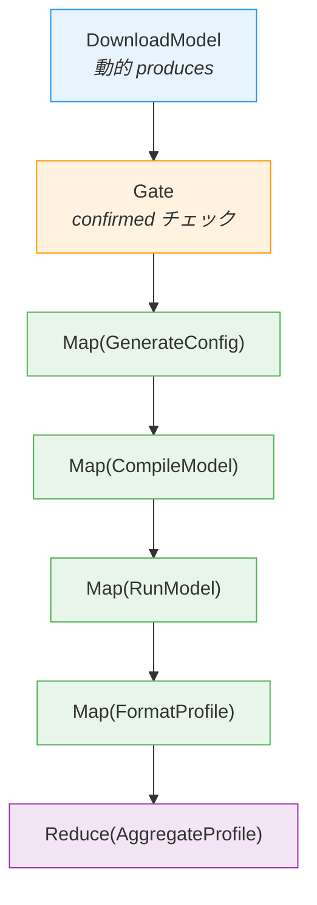
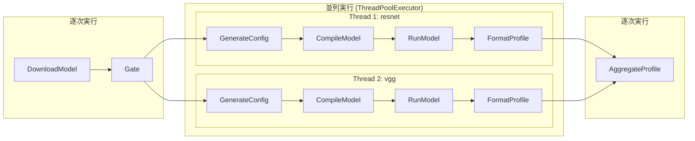
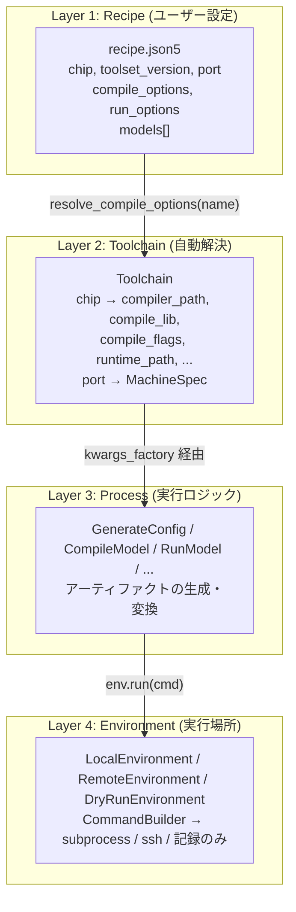
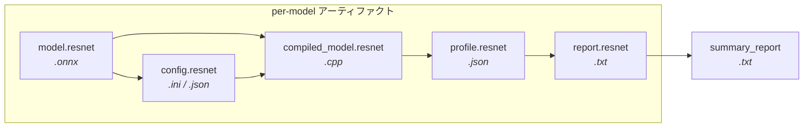
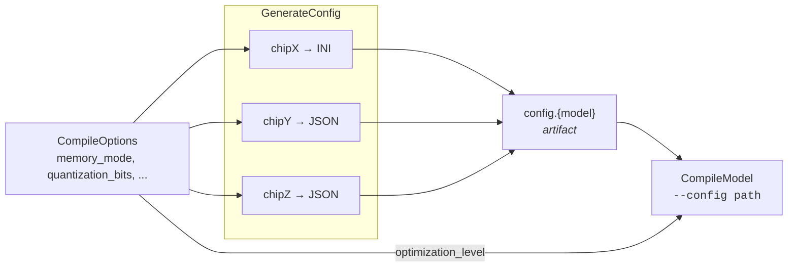

# Pipeline Artifact Model アーキテクチャ

## 概要

モデルのダウンロード・コンパイル・実行・プロファイリングを自動化するパイプラインフレームワーク。
アーティファクトベースのキャッシュ機構と、Map/Reduce による並列処理をサポートする。

## パイプライン全体像



### 実行時の動作

DownloadModel がモデルを動的に発見した後、連続する Map は **per-variant チェーン** に融合され並列実行される。



## レイヤー構成

ユーザーが触る設定から実行環境まで、4層に分離されている。



### 各レイヤーの責務

| レイヤー | 知っていること | 知らないこと |
|---------|-------------|------------|
| **Recipe** | ユーザーの意図 (チップ名, 最適化レベル, イテレーション数) | コンパイラパス, ライブラリ名 |
| **Toolchain** | チップ名 → 内部パラメータの対応 | どのモデルをコンパイルするか |
| **Process** | 入力アーティファクト → 出力アーティファクトの変換 | チップの種類 (config は artifact 経由) |
| **Environment** | コマンドをどこで実行するか | コマンドの意味 |

## アーティファクトの流れ



各アーティファクトは `Artifact` として RunContext に登録され、キャッシュキー (SHA-256) で同一性が管理される。
プロセスの入力が変わらなければ再実行をスキップする。

## チップ固有の config 生成

GenerateConfig は CompileOptions とチップ名から、チップ固有フォーマットの config ファイルを生成する。
CompileModel はフォーマットを知らず、`--config <path>` として受け取るだけ。



## フレームワークのコア概念

### ProcessBase

すべてのプロセスの基底クラス。

```
ProcessBase
├── name: str              プロセス名 (キャッシュキーの一部)
├── version: str           実装バージョン (bump → キャッシュ無効化)
├── requires: list[str]    入力アーティファクトのキー
├── produces: list[str]    出力アーティファクトのキー (空 = 動的)
├── params() → dict        キャッシュキーに含まれるパラメータ
└── run(ctx, exec_ctx) → dict[str, ProducedArtifact]
```

### Map / Reduce

```
Map(ProcessClass, kwargs_factory=...)
  → variant ごとに ProcessClass(model_name=variant, **kwargs) を生成
  → 連続する Map はチェーンに融合され並列実行

Reduce(ProcessClass)
  → 全 variant を集約する ProcessClass(model_names=[...]) を生成
```

### Phase 分割

Pipeline は steps を以下の Phase に分割して実行する:

| Phase | 構成要素 | 実行方式 |
|-------|---------|---------|
| StaticPhase | 連続する ProcessBase | 逐次実行 |
| ChainPhase | 連続する Map | per-variant 並列実行 |
| ReducePhase | Reduce | 逐次実行 |
| GatePhase | Gate | 条件チェック (未達で停止) |

### Gate

`check(ctx)` が `False` を返すと `PipelineHalted` を送出してパイプラインを停止する。
DownloadModel がモデル名をレシピに書き戻した後、ユーザーに設定確認を促すために使用される。

## ディレクトリ構成

```
pipeline_artifact_model/
├── src/
│   ├── pipeline.py       フレームワーク本体 (Artifact, RunContext, Map/Reduce, Pipeline)
│   ├── environment.py    コマンド実行環境 (Local / Remote / DryRun)
│   ├── recipe.py         レシピモデル (CompileOptions, RunOptions, Recipe)
│   ├── toolchain.py      チップ → 内部パラメータ解決 (Toolchain, ChipProfile)
│   ├── processes.py      パイプライン構成プロセス群
│   └── main.py           エントリポイント
├── recipes/
│   └── recipe.json5      テンプレートレシピ
├── tests/
│   ├── test_pipeline.py
│   ├── test_processes.py
│   ├── test_recipe.py
│   └── test_toolchain.py
└── experiments/           実行時に生成される実験ディレクトリ
    └── <name>/
        ├── recipe.json5   コピーされたレシピ
        ├── run/           RunContext (manifest.json)
        ├── out/           出力アーティファクト
        └── tmp/           一時ファイル (チェーンごとに分離)
```
